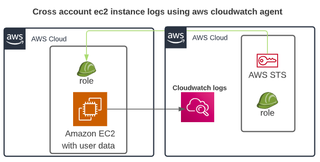

## AWS Cross account clowdwatch logs setup 

### How to set it up:
##### this is an AWS cross account cloudwatch log setup, using a bootstrap bash script, in order to set it up you will have to edit the [receiver-role-policy.json](xxx), [sender-role-policy.json](xxx) files and add the `{receiver_AWS_accountID}` plus the [target-trust.json](xxx) where you need to add the `{source_AWS_accountID}` and than referance the __role arn__ in the [user-data.sh](xxx) script. Assuming you want to send the linux logs from one AWS account to a different AWS account. 

##### Please reffer to the following link for [Installing and running the CloudWatch agent on your servers](https://docs.aws.amazon.com/AmazonCloudWatch/latest/monitoring/install-CloudWatch-Agent-commandline-fleet.html)

##  Please check the below description of the 5 groups of Linux log files, names and usage which based on your needs you can set up. 
##### From a security perspective, here are 5 groups of files which are essential. Many other files are generated and will be important for system administration and troubleshooting.

### 1. The main log file
* `/var/log/messages`- Contains global system messages, including the messages that are logged during system startup. There are several things that are logged in `/var/log/messages` including __mail, cron, daemon, kern, auth__, etc.

### 2. Access and authentication
* `/var/log/auth.log` - Contains system authorization information, including user logins and authentication machinsm that were used.
* `/var/log/lastlog` - Displays the recent login information for all the users. This is not an ascii file. You should use lastlog command to view the content of this file.
* `/var/log/btmp` - This file contains information about failed login attemps. Use the last command to view the btmp file. For example, `last -f /var/log/btmp | more`
* `/var/log/wtmp` or `/var/log/utmp` - Contains login records. Using wtmp you can find out who is logged into the system. who command uses this file to display the information.
* `/var/log/faillog` - Contains user failed login attemps. Use faillog command to display the content of this file.
* `/var/log/secure` - All user authentication events are logged here. This log file can provide detailed insight about unauthorized or failed login attempts. Can be very useful to detect possible hacking attempts. It also stores information about successful logins and tracks the activities of valid users.
* `/var/log/audit/audit.log` - Suspect that there might have been a security breach in your server? Notice a suspicious javascript file where it shouldn’t be? If so, then find this log file asap! Investigate failed login attempts. Investigate brute-force attacks and other vulnerabilities related to user authorization mechanism.

### 3. Package install/uninstall
* `/var/log/dpkg.log` - Contains information that are logged when a package is installed or removed using dpkg command
* `/var/log/yum.log` - Track the installation of system components and software packages. Check the messages logged here to see whether a package was correctly installed or not. Helps you troubleshoot issues related to software installations.

### 4. System
* `/var/log/daemon.log` - Contains information logged by the various background daemons that runs on the system
* `/var/log/cups` - All printer and printing related log messages
* `/var/log/cron` - Whenever a cron job runs (or anacron), this log file records all relevant information including successful execution and error messages in case of failures. If you're having problems with your scheduled cron, you need to check out this log file.

### 5. Applications
* `/var/log/maillog` and/or `/var/log/mail.log` - Contains the log information from the mail server that is running on the system. For example, sendmail logs information about all the sent items to this file
* `/var/log/Xorg.x.log` - Log messages from the XWindows system